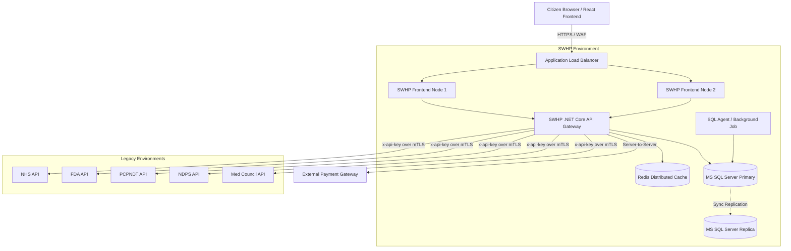

# Production-Ready Architecture Document
**Project:** Single Window Health Portal (SWHP)
**Version:** 1.0
**Status:** Approved for Production Deployment

---

## 1. Executive Summary
The Single Window Health Portal (SWHP) operates as a high-availability aggregation wrapper, integrating five distinct legacy government health systems. This document outlines the production deployment topology, security hardening, network configuration, and fault tolerance strategies required to meet the 99.5% uptime and scalability requirements.

---

## 2. High-Level System Architecture

---

## 3. Infrastructure & Deployment Topology

### 3.1 Web & App Tier
- **Frontend Hosting:** The React application is served via CDN (e.g., Cloudflare, Azure Front Door) or NGINX reverse proxies for static asset caching and fast global delivery.
- **Backend Hosting:** ASP.NET Core API deployed on a containerized environment (Docker/Kubernetes) or Auto-Scaling Virtual Machine Scale Sets. Minimum of 2 instances running behind a Layer 7 Application Load Balancer.
- **Session Management:** Stateless. JWT-based authentication ensures incoming requests can be routed to any healthy backend node.

### 3.2 Database Tier
- **Engine:** Microsoft SQL Server Enterprise.
- **High Availability:** SQL Server Always On Availability Groups configured with one synchronous primary replica (for zero data loss) and one asynchronous secondary replica (for disaster recovery in a different zone).
- **Encryption:** Transparent Data Encryption (TDE) enforced for data at rest.

### 3.3 Background Processing
- **Agent:** SQL Server Agent (or a dedicated Worker Service).
- **Task:** Daily automated payment reconciliation. It runs independently of the web application instances to ensure guaranteed execution even during web-tier scaling events.

---

## 4. Network & Security Architecture

### 4.1 Perimeter Security
- **WAF (Web Application Firewall):** Placed ahead of the Load Balancer to filter malicious traffic, rate-limit excessive requests (DDoS protection), and block OWASP Top 10 threats.
- **TLS/SSL:** Strict enforcement of TLS 1.2/1.3. HTTP traffic is permanently redirected to HTTPS at the Load Balancer level.

### 4.2 Application Security
- **Content-Security-Policy (CSP):** Legacy systems must implement `frame-ancestors 'self' https://swhp.mponline.gov.in` to prevent clickjacking.
- **Cross-Origin Messaging:** Strict `event.origin` validation is implemented in the React Frontend before processing `FormCompleted` postMessage payloads.
- **Authentication:** 
  - Passwords hashed using SHA-512 with per-user salt.
  - JWTs issued with short lifespans (e.g., 1 hour) and sliding expiration.

### 4.3 Internal API Security (Server-to-Server)
- **Authentication:** All backend-to-legacy API calls utilize API Keys (`x-api-key`). 
- **Secret Management:** API keys, database connection strings, and JWT signing keys are injected securely at runtime via a centralized Secret Manager (e.g., Azure Key Vault, AWS Secrets Manager).

---

## 5. Fault Tolerance & Disaster Recovery

### 5.1 Fault Isolation
- **Legacy System Outages:** If a legacy system (e.g., NHS) goes down, the SWHP API Gateway catches the timeout/5xx error and gracefully degrades the UI. Users can still apply and pay for the remaining healthy services.
- **Payment Gateway Failures:** If payment fails, the SWAN session is preserved. The user can retry payment without re-filling the iFrame forms.

### 5.2 Automated Reconciliation
- The asynchronous sync of payment statuses to 5 legacy systems is prone to network partitions. 
- The SWHP backend updates legacy systems concurrently (`Task.WhenAll`). Any failed request marks the `SyncStatus` as `Pending`.
- The daily SQL background job queries pending records and re-initiates the sync, ensuring eventual consistency.

### 5.3 Backup Strategy
- **Database Backups:** 
  - Full backups weekly.
  - Differential backups daily.
  - Transaction log backups every 15 minutes.
- **Retention:** Minimum 30 days for operational recovery; 7 years for financial compliance.

---

## 6. Monitoring, Logging & Alerting

### 6.1 Centralized Logging
- **Application Logs:** All ASP.NET Core and React errors are forwarded to a centralized logging system (e.g., ELK Stack, Splunk, Datadog).
- **Audit Trails:** All financial events (Payment Init, Callback, Sync) are logged alongside the `SWAN`, `UserId`, and Timestamp.

### 6.2 Health Checks
- **Probes:** The backend exposes `/health/live` and `/health/ready` endpoints. The Load Balancer uses these to remove unhealthy nodes from the rotation automatically.
- **Dependency Checks:** The `/health/ready` endpoint verifies connectivity to MS SQL Server and the Redis Cache.

### 6.3 Alerting Metrics
Alerts are routed to the DevOps/Operations team via PagerDuty/Email when the following thresholds are breached:
- API Error Rate > 2% over 5 minutes.
- Payment Reconciliation failures > 10 in a single day (`ManualReview` state triggered).
- CPU/Memory utilization > 80% on Web instances for over 10 minutes.
