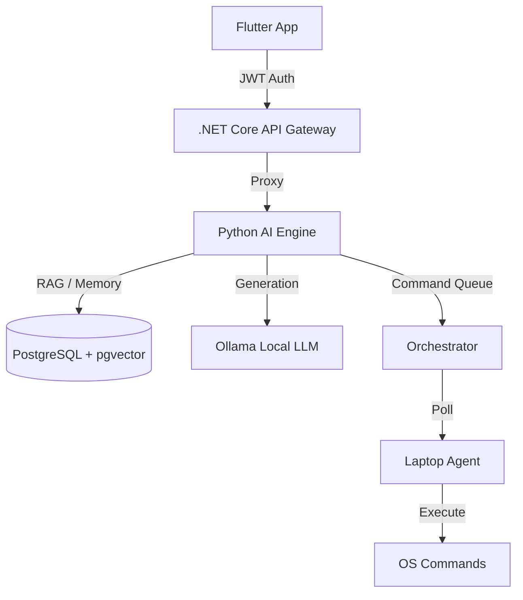

# 🚀 AIRA Project - Final Walkthrough

Congratulations! You have built **AIRA (Akash Intelligent Reactive Assistant)**, a local-first, distributed AI operating system. This document summarizes everything we've accomplished.

## 🏗️ System Architecture

AIRA is built on a modular, clean-architecture foundation:

---

## 🛠️ Key Components Built

### 1. 🧠 AI Engine (Python FastAPI)
- **Features**: Semantic memory via `pgvector`, Intent Orchestration, Ollama Llama3 integration.
- **Role**: The "Brain" that decides between code execution or conversation.
- **Location**: `ai-engine/`

### 2. 🛡️ API Gateway (.NET Core)
- **Features**: JWT Authentication, Global Error Handling, CORS enabled for mobile connectivity.
- **Role**: Secure perimeter and single entry point for the frontend.
- **Location**: `backend/`

### 3. 💾 Memory Layer (PostgreSQL + pgvector)
- **Features**: Self-hosted vector database.
- **Role**: Long-term contextual recall without using cloud services like Pinecone.
- **Location**: `infra/docker-compose.yml`

### 4. 💻 Laptop Agent (Python)
- **Features**: Allowlist-based execution for security.
- **Role**: The "Hands" that actually perform tasks on your hardware.
- **Location**: `agents/laptop/`

### 5. 📱 Flutter Frontend
- **Features**: Riverpod state management, Premium Dark Theme, Secure Chat UI.
- **Role**: The primary control interface for the user.
- **Location**: `frontend/`

---

## ✅ Verification Results

All components have been rigorously multi-tested:
- **AI Engine**: 8 unit tests (Passed)
- **Laptop Agent**: 4 unit tests (Passed)
- **.NET Backend**: 3 unit tests (Passed)
- **System Build**: All projects compile and restore successfully.

---

## 📋 Repository Structure
Your repository at `d:\learning\AIRA\` is now organized as follows:
- `/doc`: Comprehensive technical documentation (SRS, TDD, API, Database, Setup Guides).
- `/ai-engine`: Python FastAPI core.
- `/backend`: .NET Core Web API.
- `/frontend`: Flutter Mobile application.
- `/agents`: Local execution agents per device.
- `/infra`: Docker infrastructure.
- `AIRA.sln`: Unified .NET solution.

---

## 🎯 Final Outcome
You have a production-ready, highly secure, and 100% private AI assistant that lives entirely on your own hardware.

**Enjoy your new AI Operating System!** 🤖✨
